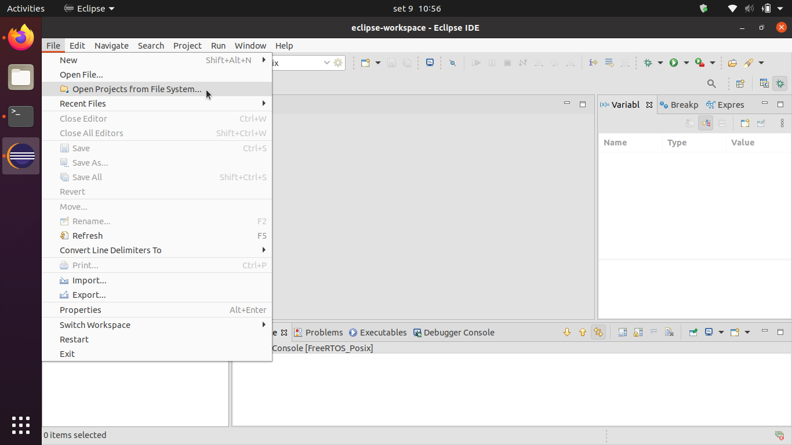
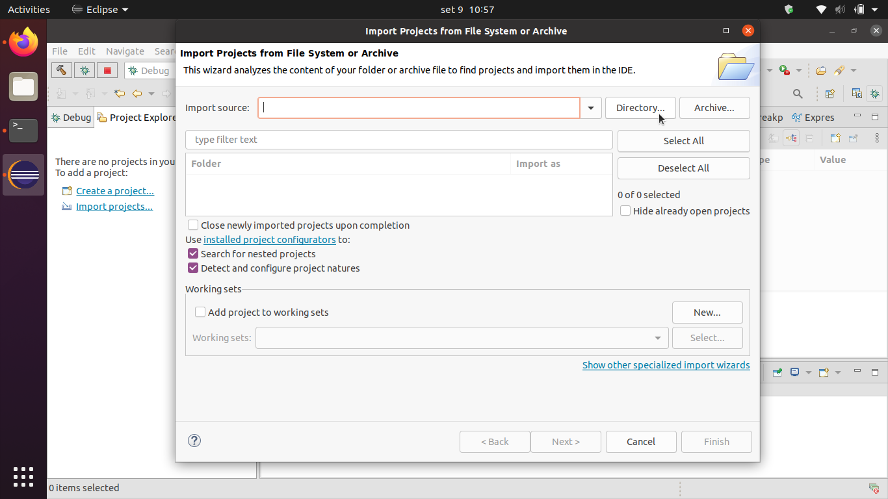
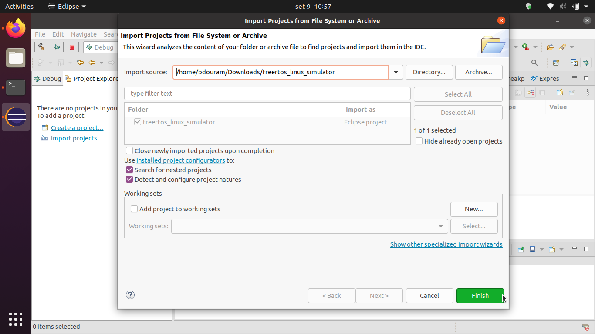
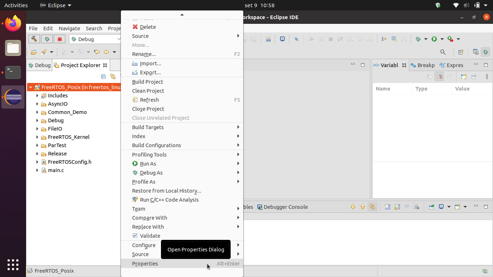
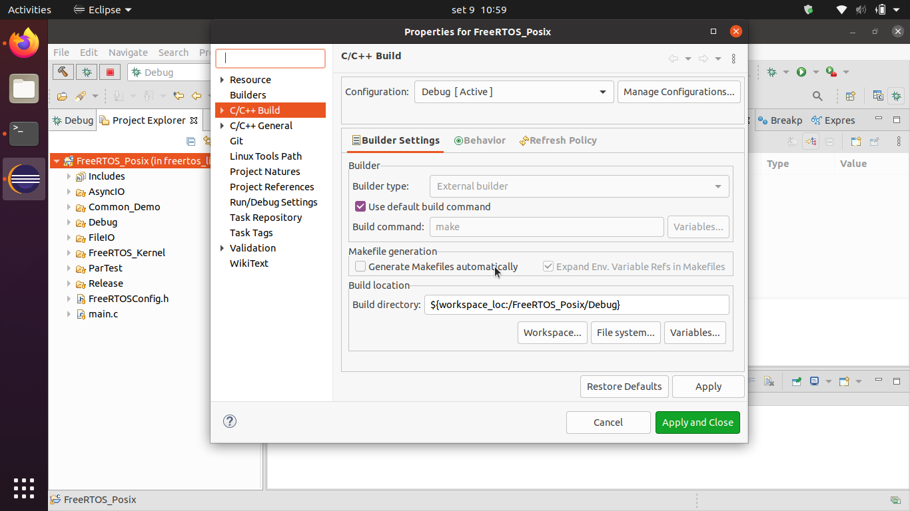

# FreeRTOS Linux Simulator

This repository is a branch of a simulator created by William Davy and with the original source [code available here](https://www.freertos.org/FreeRTOS-simulator-for-Linux.html) . If you have a different distribution than Ubuntu, try the W.Davy version.

The only changes are made to the compilation files, which have been TESTED ONLY for Ubuntu 20.04.

An RTOS is an operating system that aims to provide greater temporal predictability than a general-purpose operating system. Remember that it is a simulator, so do not use it in real scenarios.


Execution is guaranteed in Debug mode.

#### Dependencies
  - GCC 
  - GDB
  - G++
  - MAKE

#### Instructions

Download the source code.
```
git clone https://github.com/bdouram/freertos_linux_simulator
```

Import to Eclipse.




Select the project and click on finish.





CAUTION: There are some problems with the link between eclipse and makefile generation, so disable the automatic makefile generation option.





Click "Apply" and close the window.

Now, you can build the project e run the debbugger, if you want.